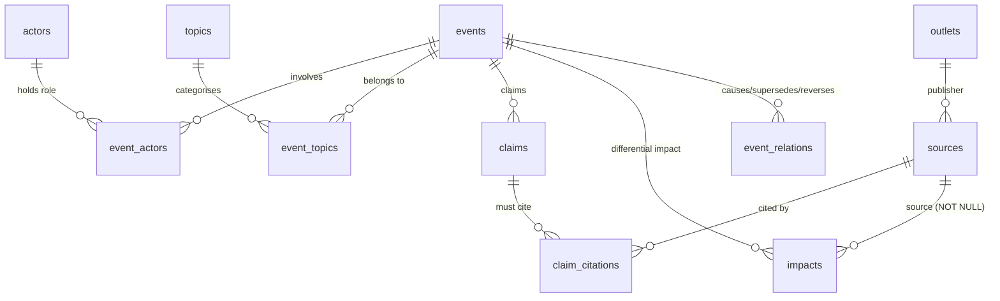
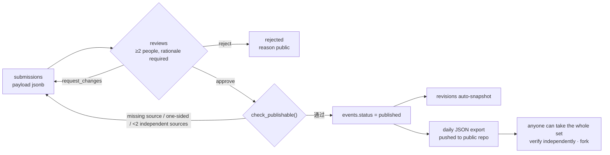

# faham · Database Structure

**English** · [中文](erd.zh.md)

Corresponds to [`db/schema.sql`](../db/schema.sql). GitHub renders the Mermaid diagrams below directly.

---

## 1. Core skeleton

The backbone: **events** in the centre, actors and topics to the left, claims and sources to the right.

---

## 2. Full structure

```mermaid
erDiagram
    actors {
        uuid id PK
        text slug UK
        enum kind "person/party/coalition/govt_body/media"
        uuid parent_id FK "parent, e.g. UMNO to BN"
        date active_from
        date active_to
        enum status
    }
    actor_i18n {
        uuid actor_id PK,FK
        enum lang PK "ms/zh/en/ta"
        text name
        text bio
    }
    outlets {
        uuid id PK
        text name
        text ownership_note "ownership fact, not stance"
        uuid ownership_source_id FK
    }
    sources {
        uuid id PK
        enum kind "news/official/academic/court"
        uuid outlet_id FK
        text title
        text url
        text archived_url "archive snapshot, prevents link rot"
        date published_on
        bool paywalled
    }
    topics {
        uuid id PK
        text key UK
        text color
    }
    topic_i18n {
        uuid topic_id PK,FK
        enum lang PK
        text name
    }
    events {
        uuid id PK
        text slug UK
        date occurred_on
        date occurred_end "multi-day event"
        enum precision "day/month/year/range"
        int weight "1-3, dot size"
        enum status "draft/in_review/published"
        bool contested "contested: both sides required"
    }
    event_i18n {
        uuid event_id PK,FK
        enum lang PK
        text title
        text summary
        text cause "cause"
        text note
    }
    event_topics {
        uuid event_id PK,FK
        uuid topic_id PK,FK
    }
    event_actors {
        uuid event_id PK,FK
        uuid actor_id PK,FK
        enum role PK "responsible/proposer/opponent/affected"
        text note
    }
    event_relations {
        uuid id PK
        uuid from_event FK
        uuid to_event FK
        enum kind "causes/supersedes/reverses/contradicts"
    }
    event_timeline {
        uuid id PK
        uuid event_id FK
        date happened_on
        text label_zh
        uuid source_id FK
    }
    claims {
        uuid id PK
        uuid event_id FK
        enum stance "support/oppose/neutral"
        uuid actor_id FK "claimant"
        text attributed_to "or free text"
        text body
        enum status
    }
    claim_citations {
        uuid claim_id PK,FK
        uuid source_id PK,FK
        text quote "verbatim quote"
        text locator "page/timecode"
    }
    impacts {
        uuid id PK
        uuid event_id FK
        text dimension "business_size/region/ethnicity"
        text label_zh
        text value_zh
        uuid source_id FK "NOT NULL: unsourced rows rejected"
    }
    media {
        uuid id PK
        uuid event_id FK
        text storage_key "self-hosted, no hotlinking"
        text caption_zh
        text license
        uuid source_id FK
    }
    users {
        uuid id PK
        text handle UK
        citext email UK
        enum tier "guest/verified/trusted/reviewer/editor"
        text alignment_note "voluntary, for diverse review pairing"
        timestamptz banned_at
    }
    user_stats {
        uuid user_id PK,FK
        int claims_accepted
        int submissions_approved
        int comments_removed
        int reports_upheld
    }
    submissions {
        uuid id PK
        enum kind "new_event/edit_event/new_claim/correction"
        uuid target_id
        jsonb payload
        text rationale
        enum state "pending/approved/rejected"
        uuid submitted_by FK
    }
    reviews {
        uuid id PK
        uuid submission_id FK
        uuid reviewer_id FK
        enum decision "approve/reject/request_changes"
        text rationale "rationale required"
    }
    corrections {
        uuid id PK
        uuid event_id FK
        uuid claim_id FK
        text description
        text resolution
        timestamptz resolved_at "unresolved ones public too"
    }
    revisions {
        bigserial id PK
        text entity_type
        uuid entity_id
        jsonb snapshot "full state after change"
        uuid author_id FK
    }
    comments {
        uuid id PK
        uuid event_id FK
        uuid parent_id FK "threaded"
        uuid author_id FK
        text body
        enum status "visible/folded/hidden/removed"
        bytea ip_hash "hash only, PDPA minimisation"
        uuid moderated_by FK
    }
    comment_reports {
        uuid id PK
        uuid comment_id FK
        uuid reporter_id FK
        text reason
        timestamptz resolved_at
        text action_taken
    }
    engagements {
        bigserial id PK
        uuid event_id FK
        enum kind "view/expand/share/cite/export"
        uuid user_id FK
        bytea session_hash "dedup, not tracking"
    }
    claim_votes {
        uuid claim_id PK,FK
        uuid user_id PK,FK
        int value "-1 or 1"
    }

    actors   ||--o{ actor_i18n     : "i18n names"
    actors   ||--o{ actors         : "parent of"
    actors   ||--o{ event_actors   : "holds role"
    actors   ||--o{ claims         : "asserts"
    outlets  ||--o{ sources        : "publishes"
    sources  ||--o| outlets        : "ownership evidence"
    sources  ||--o{ claim_citations : "cited by"
    sources  ||--o{ impacts        : "evidence for"
    sources  ||--o{ media          : "image source"
    sources  ||--o{ event_timeline : "timeline source"
    topics   ||--o{ topic_i18n     : "i18n names"
    topics   ||--o{ event_topics   : "categorises"
    events   ||--o{ event_i18n     : "i18n body"
    events   ||--o{ event_topics   : "has topic"
    events   ||--o{ event_actors   : "has actor"
    events   ||--o{ event_relations : "relates to"
    events   ||--o{ event_timeline : "status history"
    events   ||--o{ claims         : "claims"
    events   ||--o{ impacts        : "differential impact"
    events   ||--o{ media          : "media"
    events   ||--o{ comments       : "comments"
    events   ||--o{ engagements    : "engagement"
    events   ||--o{ corrections    : "corrections"
    claims   ||--o{ claim_citations : "requires source"
    claims   ||--o{ claim_votes    : "credibility votes"
    claims   ||--o{ corrections    : "corrected by"
    users    ||--|| user_stats     : "stats"
    users    ||--o{ submissions    : "submits"
    users    ||--o{ reviews        : "reviews"
    users    ||--o{ comments       : "posts"
    users    ||--o{ comment_reports : "reports"
    users    ||--o{ claim_votes    : "votes"
    users    ||--o{ engagements    : "views"
    users    ||--o{ revisions      : "revision author"
    users    ||--o{ corrections    : "files correction"
    submissions ||--o{ reviews     : "≥2 independent reviews"
    comments ||--o{ comments       : "replies to"
    comments ||--o{ comment_reports : "reported by"
```

---

## 3. How content enters the archive

---

## 4. Three rules enforced by constraints

| Rule | Enforced at | Why it cannot be bypassed |
|---|---|---|
| No unsourced figures may be published | `impacts.source_id NOT NULL` | The database rejects the write; not editorial discipline |
| Contested events must show both sides | `check_publishable()` | The function is public; anyone can run it |
| All changes leave a trace | `revisions` + trigger | The trigger writes automatically; the app layer cannot skip it |
