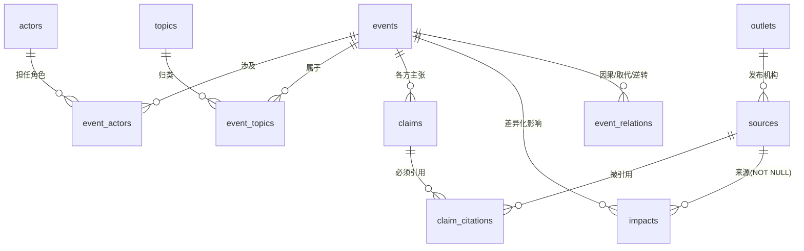
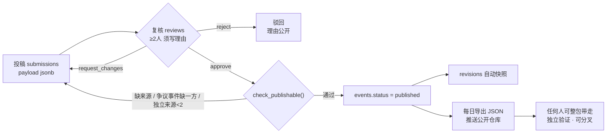

# faham · 数据库结构图

[English](erd.md) · **中文**

对应 [`db/schema.sql`](../db/schema.sql)。GitHub 可直接渲染以下 Mermaid 图。

---

## 一、核心骨架

先看主干：**事件**居中，向左连人物与议题，向右连主张与来源。

---

## 二、完整结构

```mermaid
erDiagram
    actors {
        uuid id PK
        text slug UK
        enum kind "person/party/coalition/govt_body/media"
        uuid parent_id FK "从属关系 巫统→国阵"
        date active_from
        date active_to
        enum status
    }
    actor_i18n {
        uuid actor_id PK,FK
        enum lang PK "ms/zh/en/ta"
        text name
        text bio
    }
    outlets {
        uuid id PK
        text name
        text ownership_note "所有权事实 非立场判断"
        uuid ownership_source_id FK
    }
    sources {
        uuid id PK
        enum kind "news/official/academic/court"
        uuid outlet_id FK
        text title
        text url
        text archived_url "存档快照 防链接失效"
        date published_on
        bool paywalled
    }
    topics {
        uuid id PK
        text key UK
        text color
    }
    topic_i18n {
        uuid topic_id PK,FK
        enum lang PK
        text name
    }
    events {
        uuid id PK
        text slug UK
        date occurred_on
        date occurred_end "跨期事件"
        enum precision "day/month/year/range"
        int weight "1-3 光点大小"
        enum status "draft/in_review/published"
        bool contested "争议性 发布前强制正反并列"
    }
    event_i18n {
        uuid event_id PK,FK
        enum lang PK
        text title
        text summary
        text cause "起因"
        text note
    }
    event_topics {
        uuid event_id PK,FK
        uuid topic_id PK,FK
    }
    event_actors {
        uuid event_id PK,FK
        uuid actor_id PK,FK
        enum role PK "responsible/proposer/opponent/affected"
        text note
    }
    event_relations {
        uuid id PK
        uuid from_event FK
        uuid to_event FK
        enum kind "causes/supersedes/reverses/contradicts"
    }
    event_timeline {
        uuid id PK
        uuid event_id FK
        date happened_on
        text label_zh
        uuid source_id FK
    }
    claims {
        uuid id PK
        uuid event_id FK
        enum stance "support/oppose/neutral"
        uuid actor_id FK "主张者"
        text attributed_to "或自由文本"
        text body
        enum status
    }
    claim_citations {
        uuid claim_id PK,FK
        uuid source_id PK,FK
        text quote "原文摘录"
        text locator "页码/时间码"
    }
    impacts {
        uuid id PK
        uuid event_id FK
        text dimension "business_size/region/ethnicity"
        text label_zh
        text value_zh
        uuid source_id FK "NOT NULL 无来源插不进来"
    }
    media {
        uuid id PK
        uuid event_id FK
        text storage_key "自托管 不外链"
        text caption_zh
        text license
        uuid source_id FK
    }
    users {
        uuid id PK
        text handle UK
        citext email UK
        enum tier "guest/verified/trusted/reviewer/editor"
        text alignment_note "自愿声明 用于组建多元复核组"
        timestamptz banned_at
    }
    user_stats {
        uuid user_id PK,FK
        int claims_accepted
        int submissions_approved
        int comments_removed
        int reports_upheld
    }
    submissions {
        uuid id PK
        enum kind "new_event/edit_event/new_claim/correction"
        uuid target_id
        jsonb payload
        text rationale
        enum state "pending/approved/rejected"
        uuid submitted_by FK
    }
    reviews {
        uuid id PK
        uuid submission_id FK
        uuid reviewer_id FK
        enum decision "approve/reject/request_changes"
        text rationale "必须写理由"
    }
    corrections {
        uuid id PK
        uuid event_id FK
        uuid claim_id FK
        text description
        text resolution
        timestamptz resolved_at "未解决的也公开"
    }
    revisions {
        bigserial id PK
        text entity_type
        uuid entity_id
        jsonb snapshot "变更后完整状态"
        uuid author_id FK
    }
    comments {
        uuid id PK
        uuid event_id FK
        uuid parent_id FK "楼中楼"
        uuid author_id FK
        text body
        enum status "visible/folded/hidden/removed"
        bytea ip_hash "只存哈希 PDPA最小化"
        uuid moderated_by FK
    }
    comment_reports {
        uuid id PK
        uuid comment_id FK
        uuid reporter_id FK
        text reason
        timestamptz resolved_at
        text action_taken
    }
    engagements {
        bigserial id PK
        uuid event_id FK
        enum kind "view/expand/share/cite/export"
        uuid user_id FK
        bytea session_hash "去重用 非追踪"
    }
    claim_votes {
        uuid claim_id PK,FK
        uuid user_id PK,FK
        int value "-1 或 1"
    }

    actors   ||--o{ actor_i18n     : "多语言名称"
    actors   ||--o{ actors         : "隶属于"
    actors   ||--o{ event_actors   : "担任角色"
    actors   ||--o{ claims         : "提出主张"
    outlets  ||--o{ sources        : "发布"
    sources  ||--o| outlets        : "所有权佐证"
    sources  ||--o{ claim_citations : "被引用"
    sources  ||--o{ impacts        : "佐证数据"
    sources  ||--o{ media          : "图像出处"
    sources  ||--o{ event_timeline : "节点依据"
    topics   ||--o{ topic_i18n     : "多语言名称"
    topics   ||--o{ event_topics   : "归类"
    events   ||--o{ event_i18n     : "多语言正文"
    events   ||--o{ event_topics   : "属于议题"
    events   ||--o{ event_actors   : "涉及主体"
    events   ||--o{ event_relations : "关联其他事件"
    events   ||--o{ event_timeline : "状态历程"
    events   ||--o{ claims         : "各方主张"
    events   ||--o{ impacts        : "差异化影响"
    events   ||--o{ media          : "图像资料"
    events   ||--o{ comments       : "讨论"
    events   ||--o{ engagements    : "互动信号"
    events   ||--o{ corrections    : "纠错请求"
    claims   ||--o{ claim_citations : "必须有来源"
    claims   ||--o{ claim_votes    : "可信度投票"
    claims   ||--o{ corrections    : "被纠错"
    users    ||--|| user_stats     : "行为统计"
    users    ||--o{ submissions    : "投稿"
    users    ||--o{ reviews        : "复核"
    users    ||--o{ comments       : "发表"
    users    ||--o{ comment_reports : "举报"
    users    ||--o{ claim_votes    : "投票"
    users    ||--o{ engagements    : "浏览"
    users    ||--o{ revisions      : "修改留痕"
    users    ||--o{ corrections    : "提出纠错"
    submissions ||--o{ reviews     : "至少2人独立复核"
    comments ||--o{ comments       : "回复"
    comments ||--o{ comment_reports : "被举报"
```

---

## 三、内容如何进入档案

---

## 四、三条被约束强制执行的规则

| 规则 | 执行位置 | 绕不过的原因 |
|---|---|---|
| 无来源的数字不得发布 | `impacts.source_id NOT NULL` | 数据库层拒绝写入，不是靠编辑自觉 |
| 争议事件须正反并列 | `check_publishable()` | 函数公开，任何人可自行查询验证 |
| 改动一律留痕 | `revisions` + 触发器 | 触发器自动写入，应用层无法跳过 |
